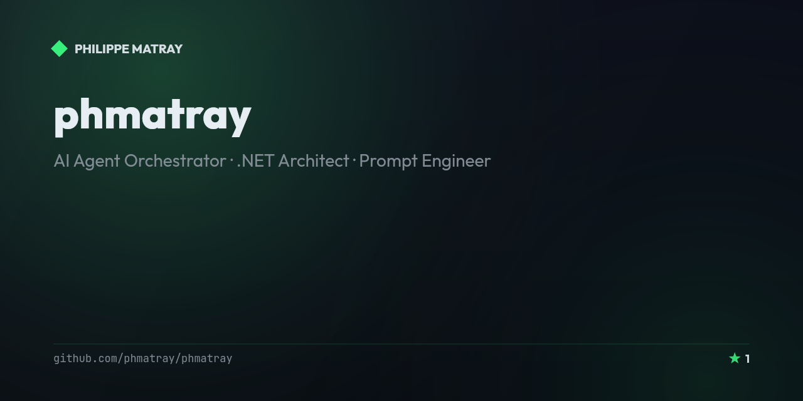

# Philippe Matray

<!-- portfolio-toc:start -->

## Table of Contents

- [The Stack (2026)](#the-stack-2026)
- [Philosophy](#philosophy)
- [What I Build](#what-i-build)
- [How I Work](#how-i-work)
- [Beyond Code](#beyond-code)
- [Contributing](#contributing)
- [License](#license)

<!-- portfolio-toc:end -->

**AI Agent Orchestrator** · **.NET Architect** · **Prompt Engineer**

---

I don't write code anymore. I orchestrate AI agents that do.

In 2025, I made a fundamental shift: from traditional software development to **AI-first orchestration**. My role is now to design systems, define specifications, and conduct multi-agent workflows that transform ideas into production-ready software.

I build with **.NET** as my runtime backbone, **Claude Code** as my primary interface, and methodologies like **BMAD** and **Spec-Driven Development** to maintain architectural rigor at AI speed.

## The Stack (2026)

| Layer | Tools |
|-------|-------|
| **Orchestration** | Claude Code, BMAD Method, Spec Kit |
| **Runtime** | .NET 10, C# 14, Blazor |
| **Infrastructure** | Azure, Docker, GitHub Actions |
| **Architecture** | DDD, Hexagonal, Clean Architecture |

## Philosophy

> "AI doesn't change the game, it just changes the way we play."

The future belongs to developers who can **think in systems** and **communicate with precision**. Prompt engineering isn't about tricks—it's about clarity of thought. The best orchestrators are those who deeply understand software architecture, because you can't direct what you don't comprehend.

## What I Build

- **Financial SaaS** — Production systems using multi-agent orchestration
- **Open-Source Libraries** — High-quality .NET components ([TaLibStandard](https://github.com/phmatray/TaLibStandard), [FormCraft](https://github.com/phmatray/FormCraft))
- **Developer Tools** — Utilities that make .NET development more elegant

## How I Work

I operate in cycles: **Specify → Plan → Orchestrate → Validate**

Each phase involves specialized AI agents with distinct roles—analyst, architect, developer, QA—working in concert. I'm the conductor. The code writes itself when the specification is precise enough.

Remote. Async. Fueled by caffeine and curiosity.

## Beyond Code

When I'm not orchestrating agents, I'm playing music. The analytical precision of architecture and the creative expression of music aren't opposites—they're complementary ways of thinking.

**INTP** · Belgium · [Email](mailto:phmatray@gmail.com)

---

GitHub Stats

 

---

<!-- portfolio-roadmap:start -->

## Roadmap

Planned work and known limitations are tracked in the [open issues](https://github.com/phmatray/phmatray/issues). Contributions toward them are welcome.

<!-- portfolio-roadmap:end -->

<!-- portfolio-sections:start -->

## Contributing

Contributions are welcome. Open an issue first to discuss any significant change.

1. Fork the repository and create your branch (`git checkout -b feat/my-feature`)
2. Commit your changes (`git commit -m 'feat: ...'`)
3. Push the branch and open a Pull Request

## License

No license has been declared for this repository yet. Until one is added, default copyright applies — see [choosealicense.com](https://choosealicense.com/) if you intend to open it up.

<!-- portfolio-sections:end -->
